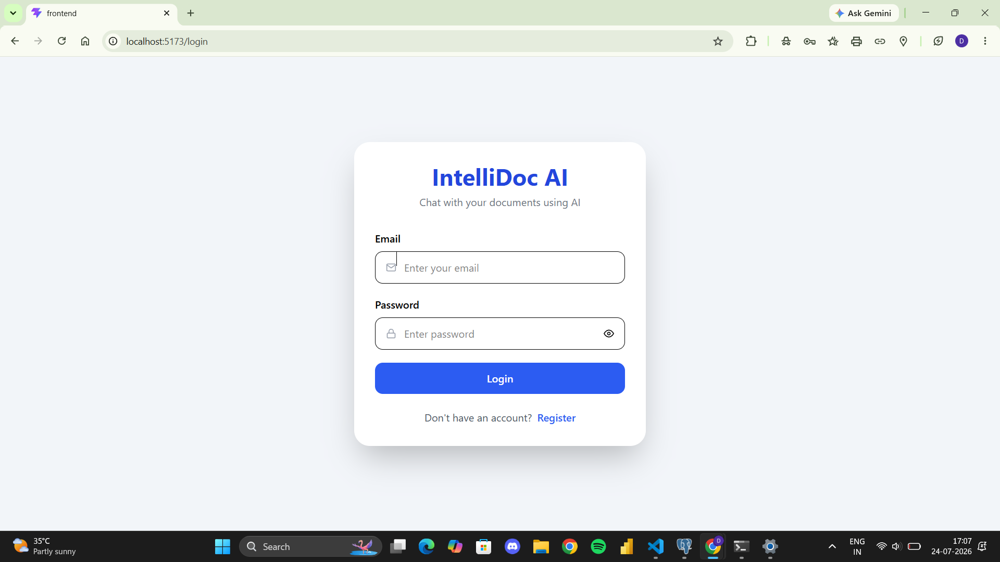
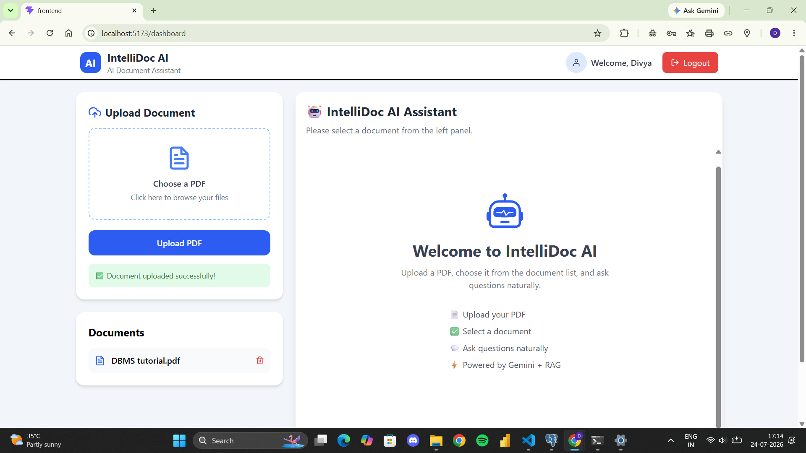
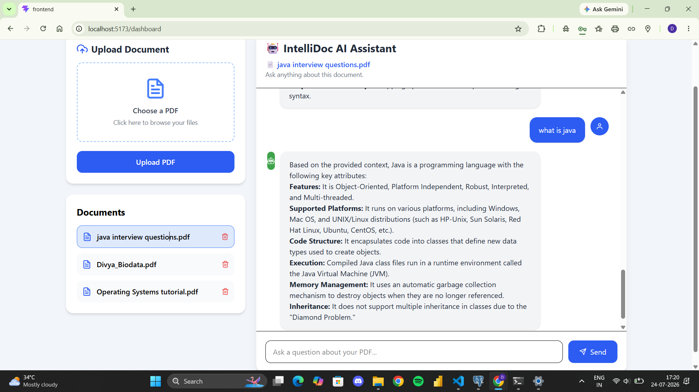

# 🧠 IntelliDoc AI

### AI-Powered Document Question Answering System using Retrieval-Augmented Generation (RAG)

Upload PDF documents, ask questions in natural language, and receive context-aware answers powered by Google's Gemini AI.

---

# 📖 Overview

IntelliDoc AI is an intelligent document assistant that enables users to upload PDF documents and interact with them using natural language. Instead of manually searching through lengthy documents, users can simply ask questions and receive accurate, context-aware responses generated through a Retrieval-Augmented Generation (RAG) pipeline powered by Google's Gemini AI.

The application combines semantic document retrieval with large language models to deliver reliable answers while maintaining chat history and secure user authentication.

---

# ❗ Problem Statement

Students, researchers, and professionals often spend significant time searching for information within lengthy PDF documents. Traditional keyword-based search methods fail to understand the context of user queries and frequently return irrelevant results.

There is a need for an intelligent system capable of understanding document content and answering questions naturally while preserving context and relevance.

---

# 💡 Solution Approach

IntelliDoc AI addresses this challenge using a Retrieval-Augmented Generation (RAG) architecture.

The workflow consists of:

1. Secure user authentication using JWT.
2. Uploading PDF documents.
3. Extracting text from uploaded PDFs.
4. Splitting extracted text into manageable chunks.
5. Creating semantic embeddings for document chunks.
6. Retrieving the most relevant chunks based on user queries.
7. Providing the retrieved context to Google's Gemini AI.
8. Generating accurate, context-aware answers.
9. Storing conversations for future reference.

This approach minimizes hallucinations by grounding AI responses in the uploaded documents.

---

# ✨ Features

## Authentication

- User Registration
- Secure Login
- JWT Authentication
- Protected Routes

## Document Management

- Upload PDF Documents
- Automatic Text Extraction
- Document Storage
- View Uploaded Documents
- Delete Documents

## AI Features

- Retrieval-Augmented Generation (RAG)
- Context-Aware Question Answering
- Semantic Search
- Google Gemini Integration

## Chat Features

- Real-time Chat Interface
- Persistent Chat History
- Document-specific Conversations
- Markdown Response Rendering

## User Experience

- Responsive UI
- Loading Indicators
- Auto Scroll
- Clean Dashboard
- Modern React Interface

---

# 🏗️ System Architecture

```
                        +----------------------+
                        |      React UI        |
                        +----------+-----------+
                                   |
                                   |
                            REST API Calls
                                   |
                                   ▼
                      +-------------------------+
                      |      FastAPI Server     |
                      +-------------------------+
                         |      |         |
                         |      |         |
                         |      |         |
                 Authentication |   Document APIs
                         |      |
                         ▼      ▼
                  PostgreSQL   PDF Processing
                                  |
                                  ▼
                           Text Extraction
                                  |
                                  ▼
                              Chunking
                                  |
                                  ▼
                          Semantic Retrieval
                                  |
                                  ▼
                           Google Gemini AI
                                  |
                                  ▼
                           Generated Answer
                                  |
                                  ▼
                           Chat History Saved
```

---

# 🔄 Application Workflow

```
User Login
      │
      ▼
Upload PDF
      │
      ▼
Extract Text
      │
      ▼
Split into Chunks
      │
      ▼
Retrieve Relevant Context
      │
      ▼
Gemini AI
      │
      ▼
Generate Answer
      │
      ▼
Store Chat History
```

---

# 🛠️ Technology Stack

## Frontend

- React 18
- TypeScript
- Tailwind CSS
- Axios
- React Hooks

## Backend

- FastAPI
- Python
- SQLAlchemy
- JWT Authentication
- Uvicorn

## Database

- PostgreSQL

## AI & NLP

- Google Gemini API
- Retrieval-Augmented Generation (RAG)
- Semantic Retrieval
- Text Chunking

## Development Tools

- Git
- GitHub
- VS Code
- Postman

---

# 📂 Project Structure

```
IntelliDoc-AI
│
├── backend
│   ├── app
│   │   ├── core
│   │   ├── database
│   │   ├── models
│   │   ├── routers
│   │   ├── schemas
│   │   ├── services
│   │   ├── auth.py
│   │   └── main.py
│   │
│   ├── requirements.txt
│   └── uploads
│
├── frontend
│   ├── src
│   │   ├── api
│   │   ├── components
│   │   ├── context
│   │   ├── pages
│   │   └── App.tsx
│   │
│   ├── package.json
│   └── vite.config.ts
│
├── .gitignore
└── README.md
```

---

# 📡 API Endpoints

## Authentication

| Method | Endpoint | Description |
|---------|----------|-------------|
| POST | `/auth/register` | Register User |
| POST | `/auth/login` | Login User |

---

## Users

| Method | Endpoint | Description |
|---------|----------|-------------|
| GET | `/users/me` | Get Current User |

---

## Documents

| Method | Endpoint | Description |
|---------|----------|-------------|
| POST | `/documents/upload` | Upload PDF |
| GET | `/documents` | List Documents |
| GET | `/documents/{id}` | Get Document |
| DELETE | `/documents/{id}` | Delete Document |

---

## Chat

| Method | Endpoint | Description |
|---------|----------|-------------|
| POST | `/chat` | Ask Questions |
| GET | `/chat/history/{document_id}` | Retrieve Chat History |

---

# ⚙️ Installation Guide

## Clone Repository

```bash
git clone https://github.com/divyamaddula05/IntelliDoc-AI.git
```

---

## Backend Setup

```bash
cd backend

python -m venv venv
```

### Windows

```bash
venv\Scripts\activate
```

### Install Dependencies

```bash
pip install -r requirements.txt
```

### Create Environment Variables

Create a `.env` file inside the backend directory.

```env
DATABASE_URL=your_database_url

SECRET_KEY=your_secret_key

GEMINI_API_KEY=your_gemini_api_key
```

### Start Backend

```bash
uvicorn app.main:app --reload
```

Backend runs at:

```
http://127.0.0.1:8000
```

---

## Frontend Setup

```bash
cd frontend

npm install

npm run dev
```

Frontend runs at:

```
http://localhost:5173
```

---

# 📸 Screenshots

## Login Page



---

## Dashboard


---

## Upload Document



---

## Chat Interface


---

# 🚀 Future Enhancements

- Multi-document Question Answering
- Source Citation Display
- Document Summarization
- Export Chat as PDF
- Voice-based Interaction
- Dark Mode
- Multi-language Support
- Cloud Storage Integration

---

# 📚 Learning Outcomes

Through this project, I gained practical experience in:

- Building REST APIs using FastAPI
- JWT-based Authentication
- PostgreSQL Integration
- SQLAlchemy ORM
- Retrieval-Augmented Generation (RAG)
- Google Gemini API Integration
- React + TypeScript Development
- Full Stack Application Development
- Git & GitHub Workflow

---

# 👩‍💻 Author

**Divya Maddula**

B.Tech – Artificial Intelligence & Data Science

GitHub:
https://github.com/divyamaddula05


---

# ⭐ Support

If you found this project helpful, please consider giving it a ⭐ on GitHub.

It motivates further development and improvements.

---

## 📄 License

This project is intended for educational and learning purposes.
